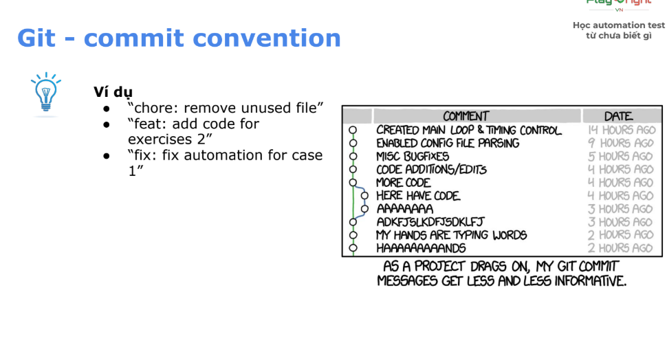
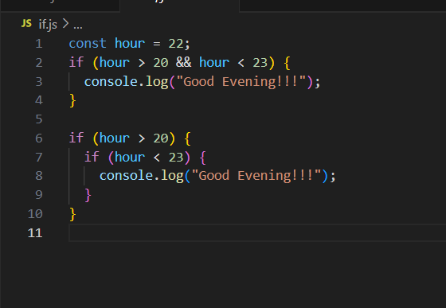

# Summary Knowledge
## Git

Git là 1 phần mềm version control system theo kiểu phân tán

Git Hub là 1 dịch vụ lưu trữ dựa trên nền tảng 

Git có 3 States là 
- Working Directory 
- Staging
    - Dùng lệnh git add để chuyển file từ Working Directory -> Staging
- Repository 
    - Dùng lệnh git commit  -m "" để chuyển file từ Staging -> Repository

Git config --global user.name -> Set username cho Git
 
Git config --global user.email -> Set useremail cho Git

**Nếu mà không set username và useremail thì sẽ không commit được**

Commit Convention
 

## JavaScript
JavaScript là 1 ngôn ngữ lập trình
### Comment
Khi thực hiện Comment thì dòng đó hay block đó sẽ không được thực thi

Có 2 cách để comment
-  Dùng  `//`
- Dùng `/*...*/`

### Variable

Biến là khái niệm cơ bản trong lập trình, Có thể thay đổi được

Có 3 loại biến : `var`, `let` và `const`
- Có thể thay đổi giá trị
    - `var` Cú pháp Cũ, Không an toàn (Không dùng)
    - `let` Cú pháp mới, An toàn hơn 
- Không thể thay đổi giá trị
    - `const` Không thể thay đổi giá trị trong suốt xử lí (Chỉ sử dụng let khi chắn chắc gán lại giá trị)

### Data Type

Là kiểu của dữ liệu

Có 8 kiểu thuộc 2 loại chính
- Loại dữ liệu nguyên thuỷ
    - `Number`
    - `String`
    - `Boolean`
    - `Undefined`
    - `Null`
    - `Symbol`
    - `BigInt`
- Loại dữ liệu tham chiếu
    - `Object`

Dùng hàm **Typeof [ variable ]** để biết được type của biến

### Operator

| Kí hiệu | Ý nghĩa | 
|-------|-------|
| `==` | **So sánh bằng** nhưng không bao gồm so sánh kiểu dữ liệu |
| `===` | **So sánh bằng** có bao gồm so sánh kiểu dữ liệu |
| `!=` | **So sánh không bằng** nhưng không bao gồm so sánh kiểu dữ liệu |
| `!==` | **So sánh không bằng** có bao gồm so sánh kiểu dữ liệu |
| `>` | So sánh lớn hơn |
| `>=` | So sánh lớn hơn hoặc bằng |
| `<` | So sánh nhỏ hơn |
| `<=` | So sánh nhỏ hơn hoặc bằng |
| `&&` | Nếu cả 2 cùng đúng thì sẽ trả về true |
| `\|\|` | Nếu chỉ 1 trong 2 mà đúng thì sẽ trả về true |
| `a++` | Trả về giá trị `a` rồi cộng giá trị a lên 1 |
| `++a` | Cộng giá trị a lên 1 rồi trả về giá trị `a` |

### Condition

Kiểm tra logic để quyết định thực hiện xử lí hay không

### Loop

Lặp đi lặp lại xử lí theo 1 logic nhất định

for (i) có 3 phần

- Điều kiện khởi tạo -> Được khởi chạy 1 lần đầu tiên vào vòng lặp
- Điều kiện lặp -> Trước mỗi chạy lặp (Bao gồm cả lần đầu tiên khi vào vòng lặp) sẽ xác nhận xem có thoả điều kiện không
- Cập nhật -> Sẽ thực hiện khi thực hiện lặp không bao gồm lần đầu tiên vào vòng lặp

